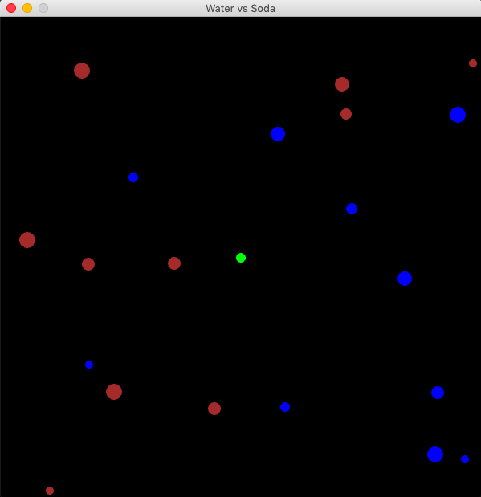

# Overview
This is a game. The player is a green circle, the water are the blue circles and the 
soda are the brown circle. The goal is for the player to consume all of the water while 
tring to avoid the soda. The water makes the player grow and the soda make the player
shrink. This game was on what my parents told me as a child. "Soda makes you shrink, so
don't drink too much."

# Development Environment
* PyCharm CE
* Python 3.8.5
* Python Arcade Library

# Execution
To execute the program: `python main.py`
Or you can also click play in PyCharm.

# Useful Websites
* [Arcade Examples](https://arcade.academy/examples/index.html)
* [Arcade Tutorial—RealPython](https://realpython.com/arcade-python-game-framework/)
